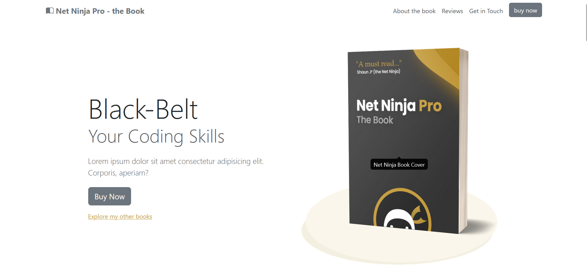

# Net Ninja Pro - the Book
## Description

This application serves as a promotional website for various types of articles. The main idea is to implement several of the tools provided by Bootstrap 5.
**Hope it helps!**

## Design




## Build Setup

```bash
# install dependencies
$ npm install
```

## Contribution

To contribute to this project please check out the [contribution guidelines](https://github.com/YurisCodingClub/accessibility-mentor/blob/main/CONTRIBUTING.md).